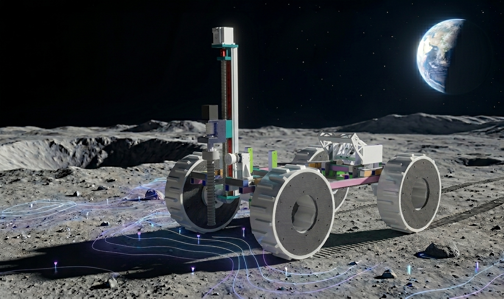

  <h1><b> He3-Seeker: Robotic Information Planning for Lunar Helium-3 Distribution Mapping</b></h1>

Submitted to the International Conference on Space Robotics (iSpaRo) 2026.

<a href="https://doongli.github.io/"><strong>Dong Li</strong></a>1,2*
&nbsp;&nbsp;
<a href=""><strong>Yujie Zheng</strong></a>3*
&nbsp;&nbsp;
<a href=""><strong>Chengdeng Cao</strong></a>4
&nbsp;&nbsp;
<a href="https://facultyce.szu.edu.cn/siyuteng/zh_CN/index.htm"><strong>Siyu Teng</strong></a>5
&nbsp;&nbsp;
<a href="https://scholar.google.com/citations?user=obmi8lYAAAAJ&hl=zh-CN"><strong>Yuchen Li</strong></a>6
&nbsp;&nbsp;
<a href="https://yanggao.people.ust.hk/"><strong>Yang Gao</strong></a>7
&nbsp;&nbsp;
<a href="https://scholar.google.com/citations?user=jzvXnkcAAAAJ&hl=zh-CN"><strong>Long Chen</strong></a>1

*These authors contributed equally to this work.
 

1Institute of Automation, Chinese Academy of Sciences
&nbsp;&nbsp;
2Macau University of Science and Technology

3China University of Petroleum-Beijing
&nbsp;&nbsp;
4Wuhan University
&nbsp;&nbsp;
5Shenzhen University

6Technical University of Munich
&nbsp;&nbsp;
7Hong Kong University of Science and Technology

 

Code and simulation will be open-sourced upon acceptance.

